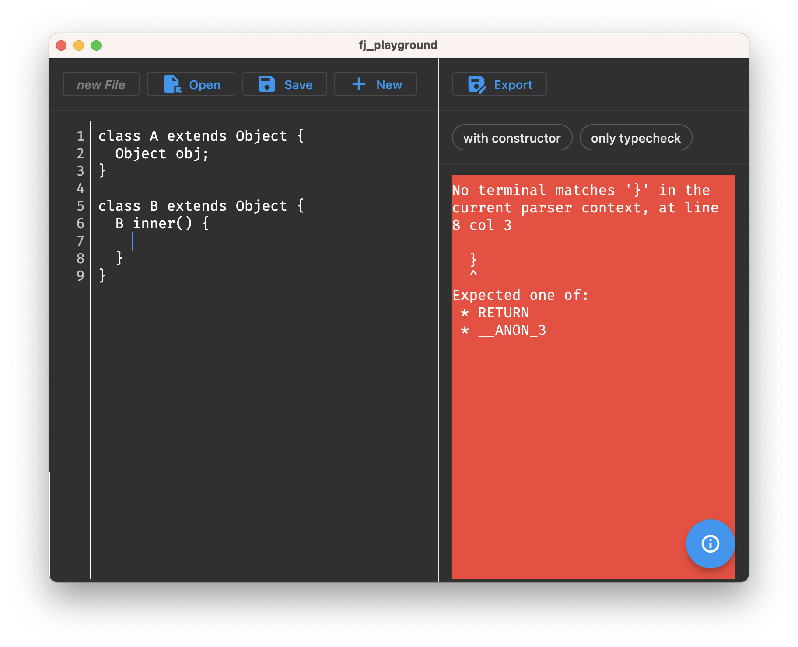

# fj_playground

A lightweight Flutter code editor for Featherweight Java programs with builtin interpreter.
This is a demo app for the [python_ffi](https://pub.dev/packages/python_ffi) package using the fj
Python project.

## Demo
[](https://user-images.githubusercontent.com/48645716/231783262-1c851119-b9ef-4cfb-bd2d-9177c34142fd.mp4 "showcase")

## Importing incomplete Python modules

Since we only need a small set of functions provided in the fj Python project, we can import the
Python module in a way that allows us to use only the functions we need. This is done by creating a
Module-definition that only contains the functions we need.

```dart
// lib/python_modules/fj.dart

import 'package:python_ffi/python_ffi.dart';

class FJParserModule extends PythonModule {
  FJParserModule.from(super.pythonModule) : super.from();

  static FJParserModule import() =>
      PythonModule.import(
        "FJ_parser",
        FJParserModule.from,
      );

  FJProgram fjParse(String sourceCodeTxt) =>
      FJProgram.from(
        getFunction("fj_parse").call(<Object?>[sourceCodeTxt]),
      );
}
```

As you can see, we only need the `fj_parse` function, so we only define that function in the
`FJParserModule` class.

## Creating an incomplete Python Class-definition

We also want to declare the return type of the `fj_parse` function as a Dart class. This requires us
to create a Dart Class-definition for the Python class `Program`. This class **will not be used** to
create instances of the Python class, but it will be used to declare the return type of the
`fj_parse` function.

```dart
// lib/python_modules/fj.dart

import 'package:python_ffi/python_ffi.dart';

class FJProgram extends PythonClass {
  FJProgram.from(super.pythonClass) : super.from();
}
```

We don't need to define any functions in the `FJProgram` class, since we only need to declare the
return type of the `fj_parse` function. For the same reason we also don't need to define a factory
constructor. The named constructor `from` is used to create a `FJProgram` instance from a Python
class instance.
